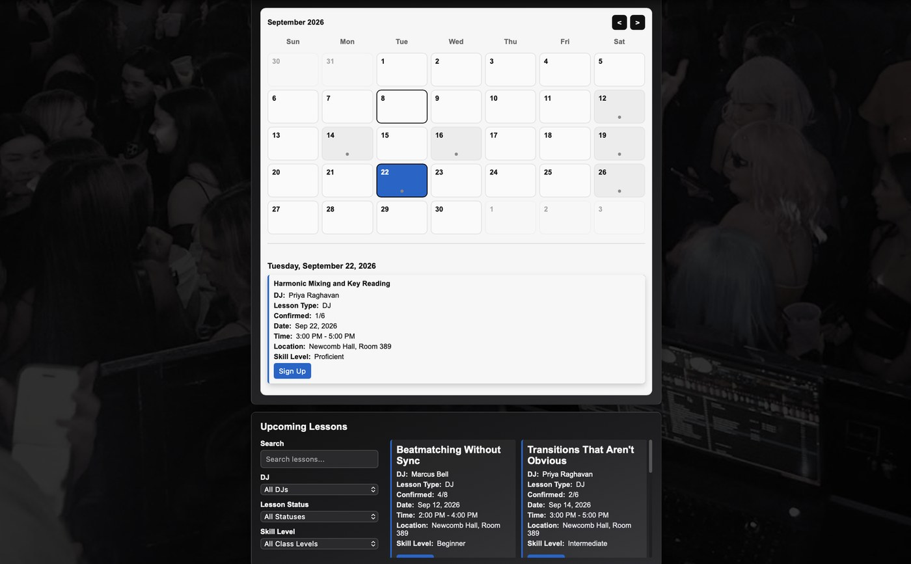
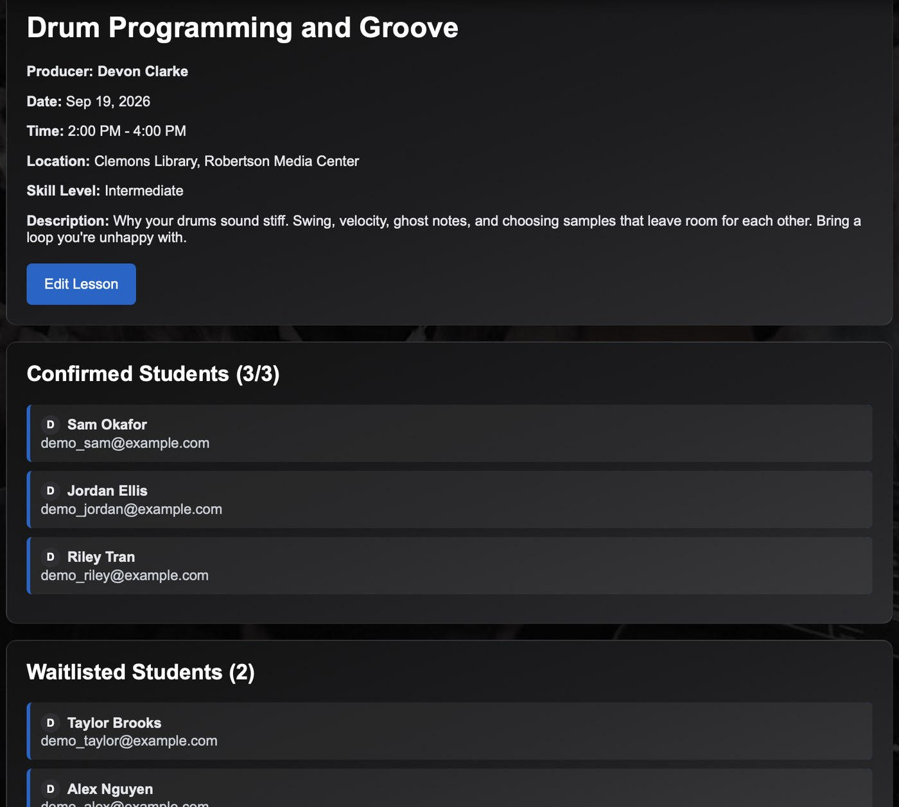
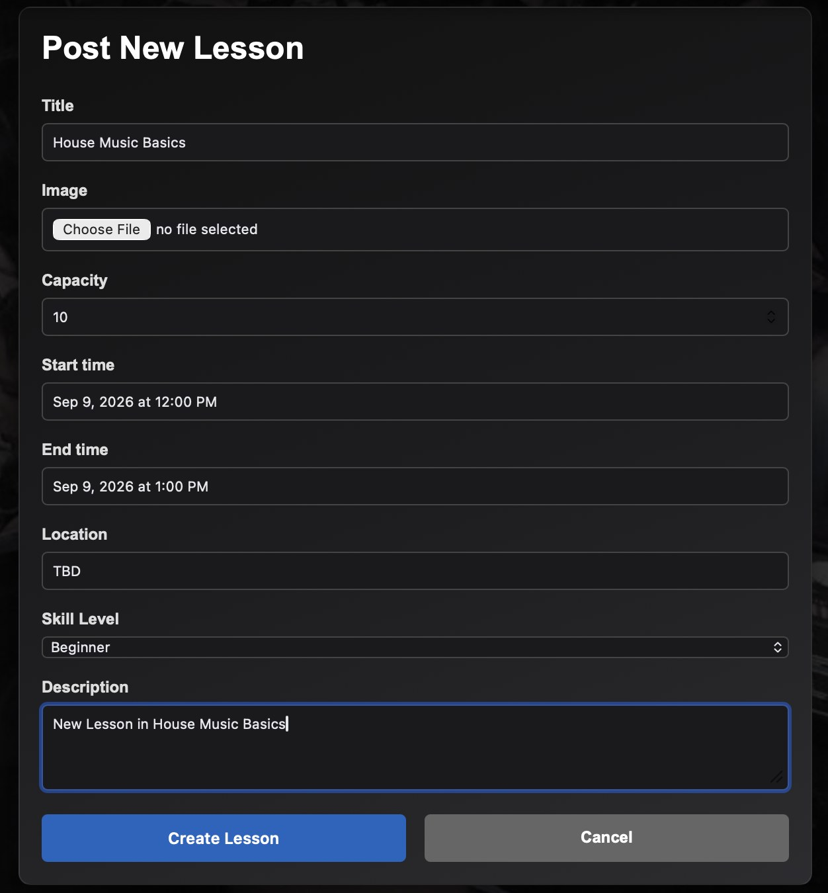
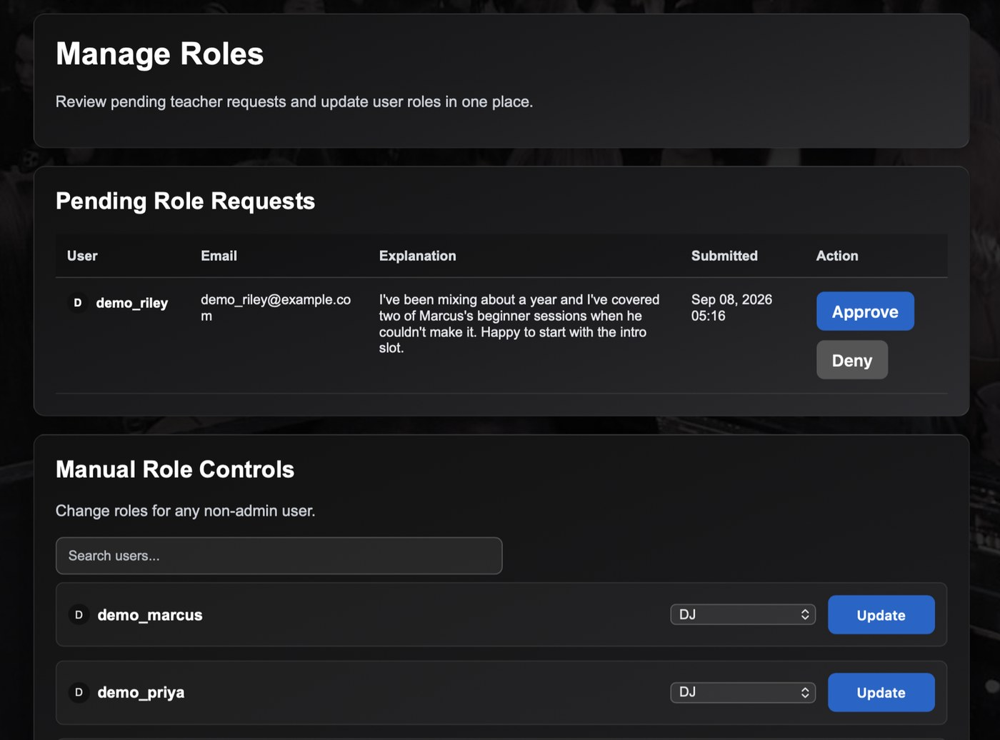

# Lesson Scheduler

**Live:** https://lesson-scheduler-uva-swe-19fc691db615.herokuapp.com (Google sign-in required)

A Django application for scheduling DJ and Producer lessons, built for UVA's Hip Hop
Organization. The club had added lessons taught by experienced executive members, and
was coordinating them over text message and Instagram DMs. This replaces that: teachers
post lessons with date, time, capacity, skill level, location and lesson type, and
students sign up for the ones that fit.

## Screenshots

| Browsing lessons | Roster and waitlist, teacher view |
|---|---|
|  |  |

| Posting a lesson | Administering roles |
|---|---|
|  |  |

## About this repository

Originally built by a five-person team for UVA CS 3240 (Software Engineering),
January–May 2026. I was the DevOps lead — release pipeline, Postgres provisioning,
S3 media storage, and migrations across development and production — and I owned the
lesson-lifecycle behavior: capacity floors tied to confirmed enrollment, and automatic
waitlist promotion when a seat opens or capacity is raised.

This copy is published with deployment configuration moved out of source and into
environment variables.

## Running locally

```bash
python -m venv .venv && source .venv/bin/activate
pip install -r requirements.txt
cp .env.example .env        # then fill in what you need
python manage.py migrate    # creates the database
python manage.py runserver
```

Only `DJANGO_SECRET_KEY` is required, and it has no fallback on purpose: the app
refuses to start without one rather than quietly using a checked-in default, which is
how real keys end up in version control. Any string works for development. Everything
else has a working default, so the app runs from a clean clone with no cloud accounts.

### Environment variables

Read from a `.env` file via python-dotenv. `.env.example` documents all of them.

| Variable | Required | Notes |
|---|---|---|
| `DJANGO_SECRET_KEY` | yes | Deliberately has no fallback default, so a real key can never be committed by accident. Any string works in development. |
| `DJANGO_DEBUG` | no | `True` for local development. Defaults to `False`. |
| `DJANGO_ALLOWED_HOSTS` | production | Comma-separated hostnames. |
| `DJANGO_CSRF_TRUSTED_ORIGINS` | production | Scheme-qualified, comma-separated. Required for POSTs over HTTPS behind a proxy. |
| `DATABASE_URL` | no | Falls back to SQLite. Set automatically on Heroku. |
| `DJANGO_POSTGRES_SSL_REQUIRE` | no | Set `False` for a local Postgres instance. |
| `CLIENT_ID`, `CLIENT_SECRET`, `GOOGLE_KEY` | for Google login | From a Google Cloud OAuth client. |
| `AWS_*` | no | See below. |

### Storage

Static files are served by WhiteNoise off the application server.

User uploads go to S3 when `AWS_ACCESS_KEY_ID`, `AWS_SECRET_ACCESS_KEY` and
`AWS_STORAGE_BUCKET_NAME` are all set, and to the local filesystem otherwise — so
you can run the whole application without an AWS account. When S3 is configured the
bucket stays private and django-storages issues presigned URLs per request.

If you do use S3, give it an IAM user scoped to that one bucket rather than
administrator credentials:

```json
{
  "Version": "2012-10-17",
  "Statement": [
    { "Effect": "Allow",
      "Action": ["s3:GetObject", "s3:PutObject", "s3:DeleteObject"],
      "Resource": "arn:aws:s3:::YOUR-BUCKET/*" },
    { "Effect": "Allow",
      "Action": ["s3:ListBucket"],
      "Resource": "arn:aws:s3:::YOUR-BUCKET" }
  ]
}
```

### Google sign-in

Login uses django-allauth with Google. Create an OAuth client (Web application) in a
Google Cloud project and register both redirect URIs:

```
http://localhost:8000/accounts/google/login/callback/
https://lesson-scheduler-uva-swe-19fc691db615.herokuapp.com/accounts/google/login/callback/
```

Google matches these exactly — a missing entry is the usual cause of a login that
fails without an obvious error.

## Using the application

**Teachers** post lessons from "Post Lessons" in the menu bar, filling in the lesson's
date, time, capacity, skill level, location and type.

**Students** sign up for any posted lesson from its "Sign Up" button.

**Both** can message each other. "Messages" opens an inbox where a user can start a
conversation with any teacher or student, or continue an existing one. Both can view
their own and others' profiles.

**Administrators** can view all users and accept or deny role-change requests — for
example, a student asking to be given the teacher role.
